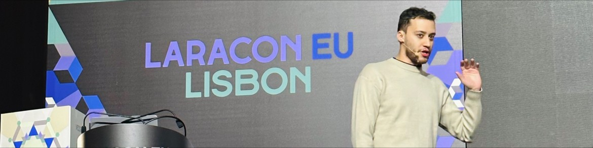

### Hi there, you found my profile! 👋

I am an experienced web developer with over a decade of experience in PHP and frameworks such as Laravel and Symfony. I am passionate about contributing to open source projects and have also had the opportunity to speak at meetups and conferences such as [Laracon EU 2023](https://laracon.eu), [PHP Portugal](https://php-portugal.com) and [Word Camp Lisbon 2023](https://lisboa.wordcamp.org/2023/).

With a comprehensive understanding of the web development industry, I take pride in delivering top-notch solutions while collaborating effectively with my team. My thirst for knowledge and passion for web development drives me to constantly improve my skills and deliver exceptional results.

- 💼 Current CTO at [Vezoa](https://github.com/vezoa) and founder of [Uncle Technologies](https://uncletechnologies.com).
- 🧑🏼‍💻 Open source contributor.
- 🎙️ Co-host of [PHP Portugal Podcast](https://podcasters.spotify.com/pod/show/php-portugal).
- 📫 You can reach me on lucasgiovanny@gmail.com or twitter [@lucgiovanny](http://twitter.com/lucgiovanny).
